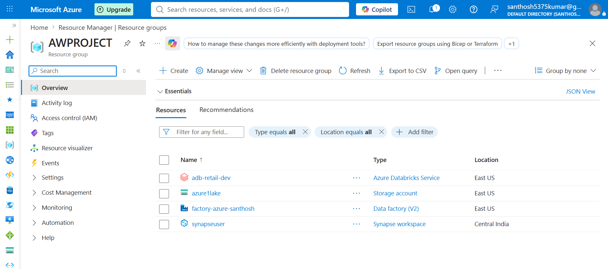
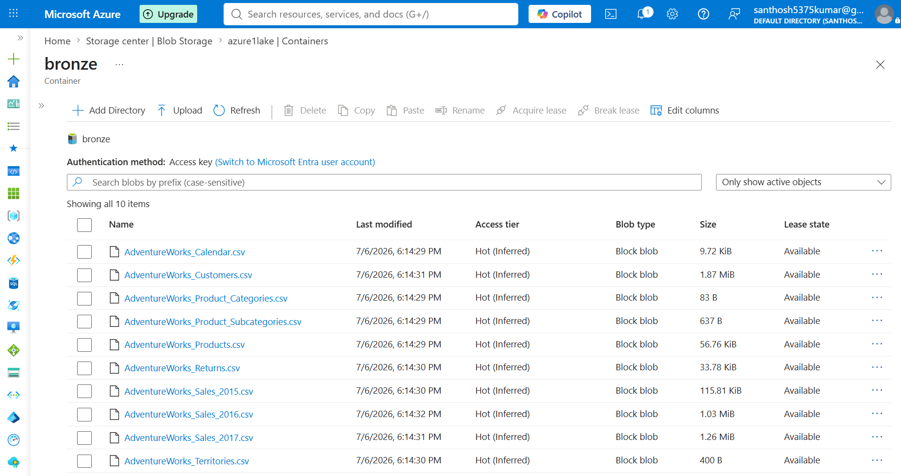
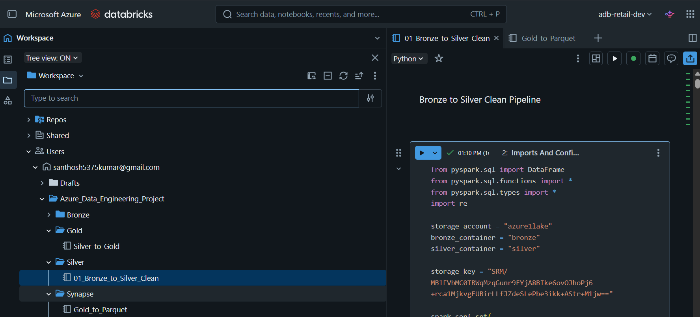
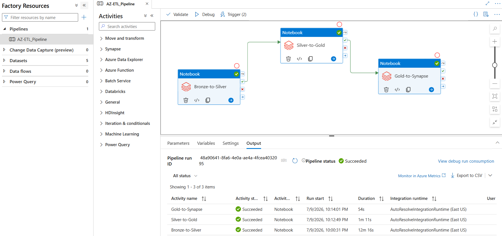
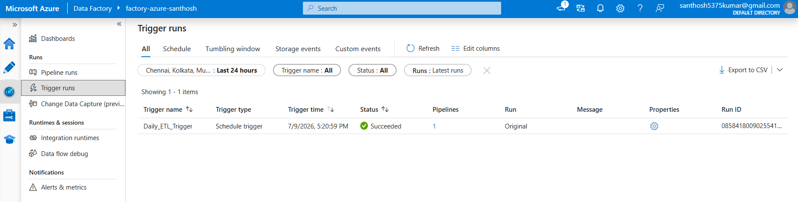
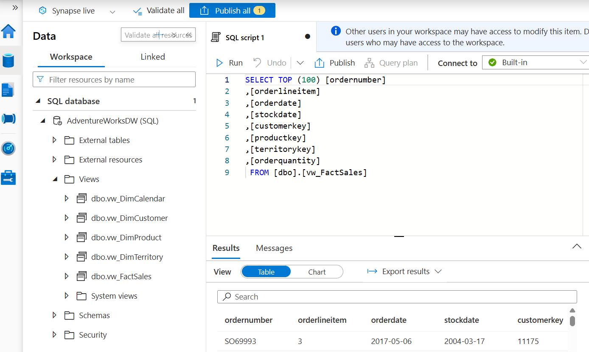
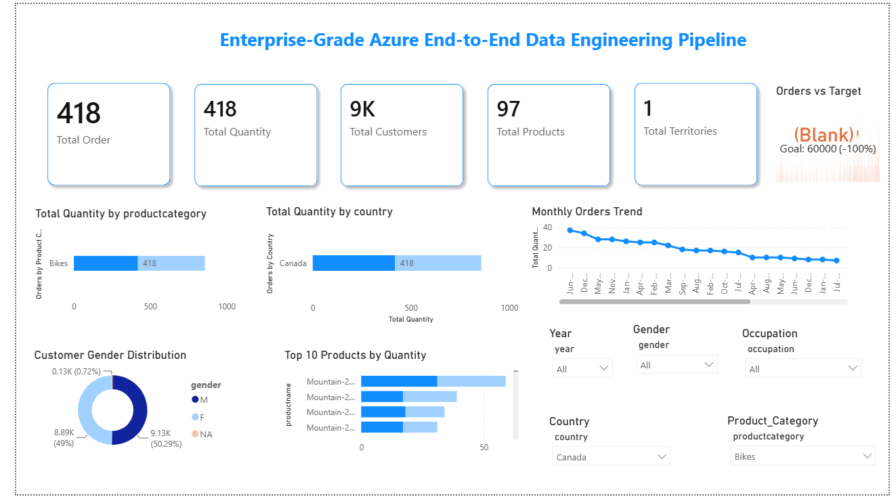

<div align="center">

# 🚀 Enterprise-Grade Azure End-to-End Data Engineering Pipeline

### Medallion Architecture (Bronze → Silver → Gold) using Azure Data Factory, Azure Databricks, Azure Synapse Analytics & Power BI

<p align="center">


</p>

---

### 📊 End-to-End Automated Azure ETL Pipeline for Enterprise Analytics

Transforming raw enterprise data into business-ready insights using Azure's modern data engineering ecosystem.

</div>


architecture/
      architecture-diagram.png
---

# 🏗️ Solution Architecture

<p align="center">


</p>

---
# 📖 Project Overview

This project demonstrates the implementation of a **production-style Azure End-to-End Data Engineering Pipeline** following the **Medallion Architecture** using Microsoft Azure services.

The solution ingests raw enterprise data into Azure Data Lake Storage Gen2, performs scalable data transformations using Azure Databricks (PySpark), orchestrates workflows with Azure Data Factory, publishes curated analytical datasets through Azure Synapse Analytics, and delivers interactive business dashboards using Microsoft Power BI.

The project simulates how enterprise organizations build modern cloud-based analytics platforms capable of processing large-scale datasets efficiently and reliably.

# 🎯 Business Problem

Organizations collect data from multiple operational systems in different formats.

Raw data usually contains:

- Duplicate records
- Missing values
- Invalid data types
- Inconsistent naming conventions
- Multiple source systems
- Poor data quality

Business users cannot directly use this raw data for reporting and analytics.

A scalable ETL pipeline is required to:

- Ingest raw enterprise datasets
- Clean and validate incoming data
- Apply business transformations
- Build analytical models
- Deliver trusted datasets for reporting

This project solves that problem using Microsoft's Azure cloud platform.

# 💡 Solution

The solution implements Microsoft's recommended **Medallion Architecture**.

```
Raw Data
     │
     ▼
Bronze Layer
     │
     ▼
Silver Layer
     │
     ▼
Gold Layer
     │
     ▼
Azure Synapse
     │
     ▼
Power BI
```

Each layer progressively improves data quality and prepares the dataset for analytics and business intelligence.


# ⭐ Key Features

✔ End-to-End Azure Data Engineering Pipeline

✔ Medallion Architecture (Bronze → Silver → Gold)

✔ Azure Data Lake Storage Gen2

✔ Azure Databricks (PySpark)

✔ Delta Lake

✔ Azure Data Factory Orchestration

✔ Azure Synapse Analytics

✔ Power BI Dashboard

✔ Automated Pipeline Trigger

✔ Fact & Dimension Modeling

✔ Enterprise Data Warehouse Design

✔ Star Schema

✔ Data Quality Validation

✔ Duplicate Removal

✔ Schema Standardization

✔ Automated Data Processing

# 🛠️ Technology Stack

| Category | Technologies |
|----------|--------------|
| Programming | Python, PySpark, SQL |
| Cloud Platform | Microsoft Azure |
| Data Lake | Azure Data Lake Storage Gen2 |
| Data Processing | Azure Databricks |
| Workflow Orchestration | Azure Data Factory |
| Data Warehouse | Azure Synapse Analytics |
| Visualization | Microsoft Power BI |
| Storage Format | Delta Lake |
| Architecture | Medallion Architecture |
| Data Modeling | Star Schema |
| Version Control | Git & GitHub |

# ☁ Azure Services Used

| Azure Service | Purpose |
|--------------|---------|
| Azure Data Lake Storage Gen2 | Store Bronze, Silver and Gold data |
| Azure Databricks | Data Engineering using PySpark |
| Azure Data Factory | ETL Pipeline Orchestration |
| Azure Synapse Analytics | Analytical Data Warehouse |
| Microsoft Power BI | Interactive Dashboards |


# 📂 Repository Structure

```text
azure-end-to-end-data-engineering-pipeline/

├── architecture/
├── notebooks/
├── adf/
├── powerbi/
├── screenshots/
├── docs/
├── README.md
├── LICENSE
└── .gitignore
```

---

# 🏗️ Solution Architecture

The project follows Microsoft's recommended **Medallion Architecture (Bronze → Silver → Gold)** to progressively improve data quality as it moves through the pipeline.

<p align="center">


</p>

---

# 🔄 End-to-End Data Pipeline

```text
        CSV Files
           │
           ▼
Azure Data Lake Storage Gen2
      (Bronze Layer)
           │
           ▼
Azure Data Factory
(Workflow Orchestration)
           │
           ▼
Azure Databricks
Bronze → Silver
(Data Cleaning & Validation)
           │
           ▼
Azure Databricks
Silver → Gold
(Business Transformation)
           │
           ▼
Azure Databricks
Gold → Synapse
           │
           ▼
Azure Synapse Analytics
(SQL Views)
           │
           ▼
Microsoft Power BI
(Business Dashboard)
```

---

# 🥉 Bronze Layer – Raw Data Ingestion

The **Bronze Layer** serves as the landing zone for raw enterprise datasets.

### Purpose

- Store raw source files
- Preserve original data
- Maintain historical source data
- Enable reprocessing if downstream failures occur

### Source Files

- Customers.csv
- Products.csv
- ProductCategories.csv
- ProductSubcategories.csv
- Returns.csv
- Territories.csv
- Calendar.csv
- Sales_2015.csv
- Sales_2016.csv
- Sales_2017.csv

### Storage

Azure Data Lake Storage Gen2

Container:

```
bronze
```

### Bronze Characteristics

- Raw CSV Files
- No business transformations
- Original schema preserved
- Acts as Single Source of Truth

---

# 🥈 Silver Layer – Data Cleansing & Standardization

The Silver layer transforms raw datasets into clean, validated, and standardized datasets.

### Data Engineering Tasks

✔ Remove duplicate records

✔ Handle missing values

✔ Standardize column names

✔ Convert data types

✔ Schema validation

✔ Null value handling

✔ Data quality checks

✔ Data normalization

✔ Standardized Delta Tables

### Output

```
Customers

Products

Calendar

Returns

Sales

Territories
```

Stored as Delta tables inside the Silver layer.

---

# 🥇 Gold Layer – Business Ready Data

The Gold layer prepares data for analytics and reporting.

Business logic is applied to create analytical datasets following dimensional modeling principles.

### Dimension Tables

```
DimCustomer

DimProduct

DimCalendar

DimTerritory
```

### Fact Table

```
FactSales
```

These tables form a **Star Schema**, enabling efficient reporting and analytics. The Gold layer is intended for business-ready, curated datasets optimized for BI workloads.

---

# ⭐ Star Schema

```text
                   DimCustomer
                        │
                        │
DimCalendar ───── FactSales ───── DimProduct
                        │
                        │
                  DimTerritory
```

### Fact Table

FactSales stores business transactions such as:

- Sales Amount
- Order Quantity
- ProductKey
- CustomerKey
- TerritoryKey
- DateKey

### Dimension Tables

Each Dimension contains descriptive attributes.

Example:

**DimCustomer**

- CustomerKey
- First Name
- Last Name
- Gender
- Occupation
- Annual Income

**DimProduct**

- Product
- Category
- SubCategory
- Price

**DimCalendar**

- Date
- Month
- Quarter
- Year

**DimTerritory**

- Country
- Region
- Group

---

# ⚙️ ETL Workflow

The project follows a traditional **ETL (Extract → Transform → Load)** architecture.

```text
Extract
    │
    ▼
CSV Files
    │
    ▼
Transform
(Azure Databricks)
    │
    ▼
Bronze
    │
    ▼
Silver
    │
    ▼
Gold
    │
    ▼
Load
(Azure Synapse Analytics)
    │
    ▼
Power BI
```

Transformations are performed in Azure Databricks before loading the curated data into Azure Synapse, which classifies this workflow as ETL rather than ELT.

---

# 🔁 Azure Data Factory Orchestration

Azure Data Factory orchestrates the complete workflow.

Pipeline Activities

```
Bronze_to_Silver

↓

Silver_to_Gold

↓

Gold_to_Synapse
```

Features implemented:

- Notebook orchestration
- Sequential execution
- Activity dependency management
- Pipeline monitoring
- Scheduled trigger automation

---

# 📊 Azure Synapse Analytics

The Gold layer is exposed through Azure Synapse Analytics for reporting.

Published Views

- vw_DimCustomer
- vw_DimProduct
- vw_DimCalendar
- vw_DimTerritory
- vw_FactSales

These views are consumed directly by Microsoft Power BI.

---

# 📈 Power BI Dashboard

An interactive dashboard was developed to visualize business insights.

### Dashboard Highlights

- Total Sales
- Total Customers
- Total Orders
- Sales by Category
- Sales by Country
- Monthly Sales Trend
- Sales by Gender
- Product Performance
- Customer Analysis
- Territory Analysis

The dashboard is built using the curated Synapse views and follows a star-schema semantic model for efficient reporting.

---


---

# ⚙️ Project Implementation

This project was developed by implementing an enterprise-style Azure Data Engineering architecture using Microsoft's cloud-native data platform.

The pipeline ingests raw CSV datasets, transforms them using PySpark in Azure Databricks, orchestrates the workflow using Azure Data Factory, exposes analytical views through Azure Synapse Analytics, and visualizes insights using Microsoft Power BI.

---

# ☁ Azure Resources

The following Azure services were used throughout the project.

| Azure Service | Purpose |
|--------------|---------|
| Azure Data Lake Storage Gen2 | Store Bronze, Silver and Gold layers |
| Azure Databricks | Data transformation using PySpark |
| Azure Data Factory | Workflow orchestration |
| Azure Synapse Analytics | SQL analytics layer |
| Power BI | Business Intelligence Dashboard |

---

# 📂 Repository Structure

```text
azure-end-to-end-data-engineering-pipeline/

├── architecture/
├── notebooks/
├── adf/
├── powerbi/
├── screenshots/
├── docs/
├── sample-data/
├── README.md
├── LICENSE
└── .gitignore
```

---

# 📁 Folder Description

| Folder | Description |
|---------|-------------|
| architecture | Solution architecture diagrams |
| notebooks | Azure Databricks notebooks |
| adf | Azure Data Factory artifacts |
| powerbi | Power BI report and dashboard |
| screenshots | Project screenshots |
| docs | Project documentation |


---

# 📒 Azure Databricks Notebooks

Three Databricks notebooks were developed to implement the Medallion Architecture.

## Notebook 1

### Bronze → Silver

Responsibilities:

- Read raw CSV files
- Validate schema
- Remove duplicates
- Handle missing values
- Convert data types
- Standardize column names
- Store cleaned Delta tables

Output

```
Silver Layer
```

---

## Notebook 2

### Silver → Gold

Responsibilities

- Read Silver Delta tables
- Apply business transformations
- Create Dimension tables
- Create Fact table
- Implement Star Schema

Output

```
DimCustomer

DimProduct

DimCalendar

DimTerritory

FactSales
```

---

## Notebook 3

### Gold → Synapse

Responsibilities

- Read Gold Delta tables
- Publish analytical datasets
- Create SQL Views
- Enable Power BI reporting

Output

```
vw_DimCustomer

vw_DimProduct

vw_DimCalendar

vw_DimTerritory

vw_FactSales
```

---

# 🔄 Azure Data Factory Pipeline

The entire workflow is orchestrated using Azure Data Factory.

Pipeline Activities

```text
Bronze_to_Silver

↓

Silver_to_Gold

↓

Gold_to_Synapse
```

Pipeline Features

- Sequential execution
- Dependency management
- Activity monitoring
- Retry support
- Automated scheduling

---

# ⏱ Pipeline Trigger

The pipeline is configured with an Azure Data Factory **Schedule Trigger**.

### Current Automation

```text
Schedule Trigger

↓

Azure Data Factory

↓

Bronze → Silver

↓

Silver → Gold

↓

Gold → Synapse
```

This allows the ETL process to execute automatically at scheduled intervals without manual intervention.

> **Future Enhancement:** Replace the schedule trigger with an **Event Trigger** so the pipeline starts automatically whenever new files are uploaded to the Bronze container.

---

# 📊 Azure Synapse Analytics

Azure Synapse serves as the analytics layer.

The Gold layer is published as SQL views.

Available Views

- vw_DimCustomer
- vw_DimProduct
- vw_DimCalendar
- vw_DimTerritory
- vw_FactSales

These views are consumed directly by Microsoft Power BI.

---

# 📈 Power BI Dashboard

Interactive dashboards were created using Azure Synapse views.

### Business KPIs

- Total Sales
- Total Orders
- Total Customers
- Sales by Category
- Sales by Country
- Monthly Sales Trend
- Customer Demographics
- Territory Analysis

---

# 📸 Project Screenshots

## Azure Resources
 

 

---

## Bronze Layer

 

 

---

## Azure Databricks

 

 

---

## Azure Data Factory Pipeline

 

 

---

## Pipeline Automation

 

 

---

## Azure Synapse

 

 

---

## Power BI Dashboard

 

 

---

# 🚀 Key Achievements

✔ Designed an enterprise-grade Medallion Architecture

✔ Built an end-to-end ETL pipeline using Azure services

✔ Automated workflow orchestration using Azure Data Factory

✔ Implemented Delta Lake for optimized storage

✔ Developed dimensional models (Fact & Dimension tables)

✔ Built an interactive Power BI dashboard

✔ Implemented scheduled pipeline execution

✔ Created a scalable and modular data engineering solution

---

---

# 🚀 Getting Started

Follow the steps below to reproduce the project.

## Prerequisites

Before running the project, ensure you have access to the following:

- Microsoft Azure Subscription
- Azure Data Lake Storage Gen2
- Azure Databricks Workspace
- Azure Data Factory
- Azure Synapse Analytics
- Power BI Desktop
- Git
- GitHub Account

---

# 📥 Clone Repository

```bash
git clone https://github.com/Santhoshkumar-123/azure-end-to-end-data-engineering-pipeline

cd azure-end-to-end-data-engineering-pipeline
```

---

# ⚙️ Project Setup

## Step 1

Create an Azure Resource Group.

---

## Step 2

Create the following Azure services:

- Azure Data Lake Storage Gen2
- Azure Databricks
- Azure Data Factory
- Azure Synapse Analytics

---

## Step 3

Upload the AdventureWorks CSV files into the **Bronze** container.

```
bronze/
```

---

## Step 4

Import the Databricks notebooks.

```
01_Bronze_to_Silver_Clean

02_Silver_to_Gold

03_Gold_to_Synapse
```

---

## Step 5

Create the Azure Data Factory pipeline.

```
Bronze_to_Silver

↓

Silver_to_Gold

↓

Gold_to_Synapse
```

---

## Step 6

Publish all Azure Data Factory artifacts.

---

## Step 7

Execute the pipeline manually or using the configured Schedule Trigger.

---

## Step 8

Verify the generated SQL views inside Azure Synapse.

```
vw_DimCustomer

vw_DimProduct

vw_DimCalendar

vw_DimTerritory

vw_FactSales
```

---

## Step 9

Open the Power BI report.

```
AdventureWorks_Dashboard.pbix
```

Refresh the dataset.

Your dashboard is now ready.

---

# 📈 Results

The project successfully demonstrates:

- Enterprise ETL implementation
- Automated workflow orchestration
- Medallion Architecture
- Delta Lake implementation
- Fact & Dimension modeling
- Star Schema design
- Azure Synapse integration
- Interactive Power BI reporting

---

# 📊 Key Project Metrics

| Metric | Value |
|---------|------|
| Architecture | Medallion |
| ETL Pipeline | Automated |
| Layers | Bronze, Silver, Gold |
| Storage | Azure Data Lake Storage Gen2 |
| Processing Engine | Azure Databricks |
| Workflow | Azure Data Factory |
| Data Warehouse | Azure Synapse Analytics |
| Reporting | Microsoft Power BI |
| Data Model | Star Schema |

---

# 📌 Future Enhancements

The current implementation provides a complete batch ETL solution.

Potential improvements include:

- Event Trigger based pipeline execution
- Incremental data loading
- Delta MERGE operations
- Azure Key Vault integration
- CI/CD using Azure DevOps or GitHub Actions
- Unit testing for notebooks
- Data Quality Framework
- Logging & Audit Tables
- Monitoring & Alerts
- Infrastructure as Code using Terraform or Bicep

---

# 💼 Resume Highlights

### Azure End-to-End Data Engineering Pipeline

- Built an enterprise-grade Azure Data Engineering solution using Azure Data Lake Storage Gen2, Azure Databricks, Azure Data Factory, Azure Synapse Analytics, and Microsoft Power BI.
- Implemented the Medallion Architecture (Bronze → Silver → Gold) using PySpark and Delta Lake.
- Developed reusable ETL notebooks for data cleansing, validation, transformation, and dimensional modeling.
- Automated end-to-end pipeline orchestration using Azure Data Factory.
- Published analytical datasets through Azure Synapse and created interactive Power BI dashboards.

---

# 🎤 Interview Topics Covered

This project demonstrates practical experience with:

- Azure Data Engineering
- Azure Data Factory
- Azure Databricks
- Azure Synapse Analytics
- Azure Data Lake Storage Gen2
- Delta Lake
- PySpark
- SQL
- ETL Pipeline
- Medallion Architecture
- Data Warehouse
- Star Schema
- Fact & Dimension Tables
- Workflow Automation
- Power BI
- Cloud Analytics

---

# 📚 Learning Outcomes

Through this project, I gained hands-on experience in:

- Designing scalable cloud-based ETL pipelines
- Implementing enterprise data engineering patterns
- Building modern data lake architectures
- Developing distributed data transformation workflows using PySpark
- Orchestrating workflows using Azure Data Factory
- Designing analytical data models
- Building business intelligence dashboards
- Managing end-to-end Azure analytics solutions

---

# 👨‍💻 Author

**Santhosh Kumar K G**

M.Tech – Computer Science & Engineering

Aspiring Data Engineer

📍 Bengaluru, India

### Connect with me

- LinkedIn: https://www.linkedin.com/in/https://www.linkedin.com/in/santhosh01kumar/
- GitHub: https://github.com/https://github.com/Santhoshkumar-123 

---

# ⭐ Support

If you found this project useful:

⭐ Star this repository

🍴 Fork this repository

📢 Share it with your network

---


<div align="center">

## ⭐ If you like this project, don't forget to star the repository!

### Thank you for visiting.

 

</div>
