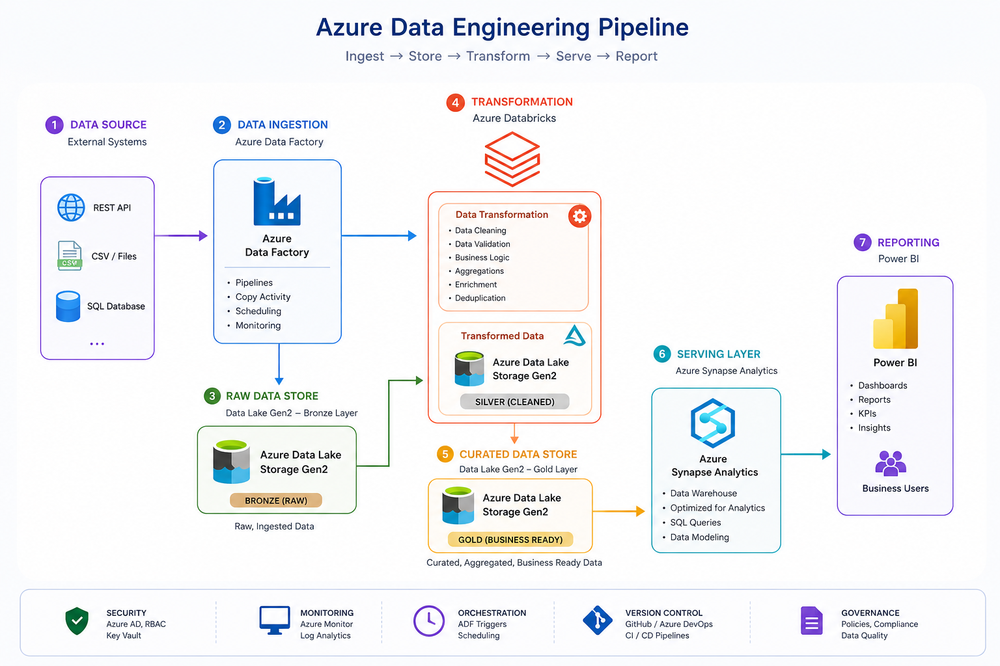
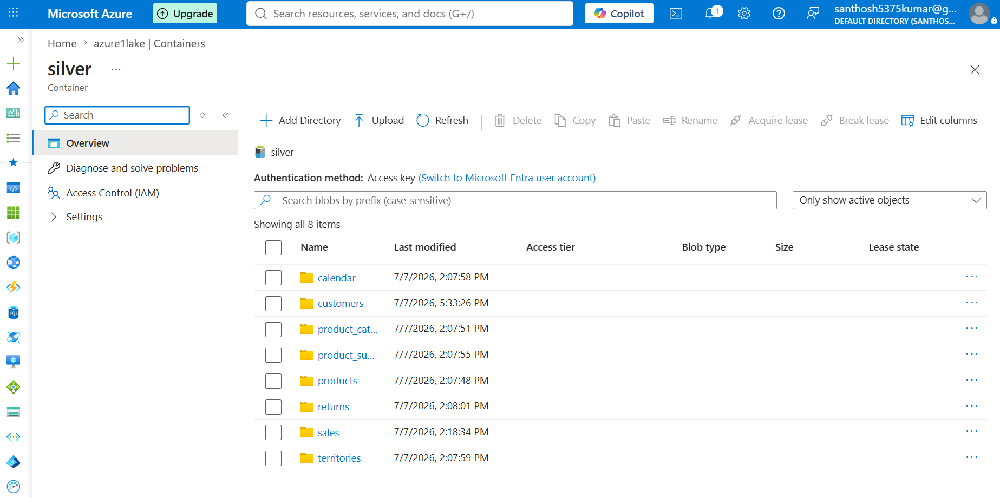

<div align="center">

# Enterprise-Grade Azure End-to-End Data Engineering Pipeline

### Medallion Architecture using Azure Data Lake Storage Gen2, Azure Databricks, Azure Data Factory, Azure Synapse Analytics, and Power BI


A practical Azure Data Engineering project demonstrating how raw business data is transformed into analytics-ready datasets using a modern cloud data platform.

</div>

---

# Architecture



---

# Project Overview

This project demonstrates the implementation of an end-to-end Azure Data Engineering pipeline using the Medallion Architecture (Bronze → Silver → Gold).

The pipeline ingests raw CSV datasets into Azure Data Lake Storage Gen2, processes them using Azure Databricks (PySpark), orchestrates execution through Azure Data Factory, publishes analytical datasets in Azure Synapse Analytics, and visualizes business insights using Power BI.

The primary objective of this project was to gain practical experience with modern cloud-based ETL pipelines, data transformation, dimensional modeling, and workflow orchestration.

---

# Technology Stack

| Category | Technology |
|-----------|------------|
| Cloud Platform | Microsoft Azure |
| Programming | Python, PySpark, SQL |
| Storage | Azure Data Lake Storage Gen2 |
| Data Processing | Azure Databricks |
| Orchestration | Azure Data Factory |
| Analytics | Azure Synapse Analytics |
| Visualization | Power BI |
| Storage Format | Delta Lake |
| Version Control | Git & GitHub |

---

# Architecture Overview

```

CSV Files

↓

Azure Data Lake Storage Gen2

(Bronze)

↓

Azure Databricks

(Bronze → Silver)

↓

Azure Databricks

(Silver → Gold)

↓

Azure Synapse Analytics

↓

Power BI Dashboard

```

---

# Key Features

- End-to-end ETL pipeline
- Medallion Architecture
- Data quality validation
- Delta Lake implementation
- Fact and Dimension modeling
- Star Schema
- Azure Data Factory orchestration
- Interactive Power BI dashboard

---


# Solution Architecture

This project follows the **Medallion Architecture**, where data quality improves as it moves through three layers:

- **Bronze** – Raw data ingestion
- **Silver** – Data cleansing and standardization
- **Gold** – Business-ready analytical datasets

Each layer has a specific responsibility, making the pipeline modular, scalable, and easier to maintain.

---

# Data Pipeline

```text
AdventureWorks CSV Files
           │
           ▼
Azure Data Lake Storage Gen2
        Bronze Layer
           │
           ▼
Azure Data Factory
 (Pipeline Orchestration)
           │
           ▼
Azure Databricks
 Bronze → Silver
           │
           ▼
Azure Databricks
 Silver → Gold
           │
           ▼
Azure Synapse Analytics
           │
           ▼
Power BI Dashboard
```

---

# Medallion Architecture

## Bronze Layer

The Bronze layer stores the raw source data exactly as it is received.

**Responsibilities**

- Store source CSV files
- Preserve original data
- Maintain historical records
- Support data reprocessing

**Source Files**

- Customers
- Products
- Product Categories
- Product Subcategories
- Calendar
- Territories
- Returns
- Sales (2015–2017)

<p align="center">

</p>

---

## Silver Layer

The Silver layer transforms raw data into clean and standardized datasets using PySpark.

**Data Processing**

- Remove duplicate records
- Handle missing values
- Convert data types
- Standardize column names
- Validate schema
- Improve data quality

**Output**

- Customers
- Products
- Calendar
- Territories
- Returns
- Sales
 

---

## Gold Layer

The Gold layer prepares curated datasets optimized for analytics and reporting.

**Dimension Tables**

- DimCustomer
- DimProduct
- DimCalendar
- DimTerritory

**Fact Table**

- FactSales

The Gold layer follows a **Star Schema** design to support efficient analytical queries.

---

# Data Model

```text
               DimCustomer
                    │
                    │
DimCalendar ─── FactSales ─── DimProduct
                    │
                    │
              DimTerritory
```

---

# ETL Workflow

The pipeline follows an **Extract → Transform → Load (ETL)** approach.

1. Extract raw CSV files from Azure Data Lake Storage.
2. Transform data using Azure Databricks (PySpark).
3. Load curated datasets into Azure Synapse Analytics.
4. Visualize business insights using Power BI.

---

# Azure Data Factory

Azure Data Factory orchestrates the complete workflow by executing Databricks notebooks in sequence.

```text
Bronze_to_Silver
        │
        ▼
Silver_to_Gold
        │
        ▼
Gold_to_Synapse
```

**Capabilities**

- Sequential execution
- Activity dependency management
- Pipeline monitoring
- Scheduled execution

<p align="center">

</p>

---

# Azure Synapse Analytics

The Gold layer is exposed through SQL views for reporting.

**Published Views**

- vw_DimCustomer
- vw_DimProduct
- vw_DimCalendar
- vw_DimTerritory
- vw_FactSales

<p align="center">

</p>

---

# Power BI Dashboard

Power BI connects to Azure Synapse Analytics to provide interactive reporting.

**Dashboard Highlights**

- Sales Overview
- Customer Analysis
- Product Performance
- Territory Analysis
- Monthly Sales Trend
- Category-wise Sales

<p align="center">

</p>

---

# Repository Structure

```text
azure-end-to-end-data-engineering-pipeline/
│
├── architecture/
│   ├── architecture-diagram.png
│   └── architecture.drawio
│
├── notebooks/
│   ├── 01_Bronze_to_Silver_Clean.py
│   ├── 02_Silver_to_Gold.py
│   └── 03_Gold_to_Synapse.py
│
├── adf/
│   ├── pipelines/
│   ├── datasets/
│   ├── linkedServices/
│   └── triggers/
│
├── powerbi/
│   ├── Dashboard.pbix
│   ├── Dashboard.pdf
│   └── Dashboard.png
│
├── screenshots/
│
├── docs/
│   ├── Project_Report.pdf
│   ├── User_Guide.pdf
│   └── Installation_Guide.pdf
│
├── README.md
├── LICENSE
├── requirements.txt
└── .gitignore
```

---

# Screenshots

## Azure Resources

<p align="center">

</p>

---

## Azure Data Factory Pipeline

<p align="center">

</p>

---

## Azure Synapse Analytics

<p align="center">

</p>

---

## Power BI Dashboard

<p align="center">

</p>

---

# Getting Started

## Prerequisites

- Microsoft Azure Subscription
- Azure Data Lake Storage Gen2
- Azure Databricks
- Azure Data Factory
- Azure Synapse Analytics
- Power BI Desktop
- Python 3.10+
- Git

---

## Clone Repository

```bash
git clone https://github.com/Santhoshkumar-123/azure-end-to-end-data-engineering-pipeline.git

cd azure-end-to-end-data-engineering-pipeline
```

---

## Deployment Steps

1. Create Azure resources.
2. Upload the AdventureWorks dataset to the Bronze container.
3. Import the Databricks notebooks.
4. Configure Azure Data Factory linked services.
5. Execute the pipeline.
6. Verify SQL views in Azure Synapse.
7. Open and refresh the Power BI report.

---

# Pipeline Execution

```text
Upload CSV Files

↓

Run Azure Data Factory Pipeline

↓

Bronze → Silver

↓

Silver → Gold

↓

Gold → Synapse

↓

Power BI Dashboard
```

---

# Project Results

The project successfully demonstrates:

- End-to-end Azure ETL pipeline
- Medallion Architecture implementation
- Automated workflow orchestration
- Delta Lake storage
- Star Schema data model
- Analytical SQL views
- Interactive Power BI dashboard

---

# Documentation

Additional documentation is available in the **docs/** folder.

| Document | Description |
|----------|-------------|
| Project_Report.pdf | Technical implementation details |
| User_Guide.pdf | Project usage guide |
| Installation_Guide.pdf | Deployment instructions |

---

# Results

This project demonstrates the implementation of a complete Azure Data Engineering pipeline using modern cloud services and industry-standard architectural patterns.

## Key Outcomes

- Implemented an end-to-end ETL pipeline
- Applied the Medallion Architecture (Bronze → Silver → Gold)
- Automated workflow orchestration using Azure Data Factory
- Built a Star Schema with Fact and Dimension tables
- Published analytical datasets through Azure Synapse Analytics
- Developed an interactive Power BI dashboard
- Implemented scalable data transformations using PySpark and Delta Lake

---

# Future Improvements

This project can be extended with additional enterprise features such as:

- Event-based pipeline triggers
- Incremental data loading
- Delta MERGE operations
- Azure Key Vault integration
- CI/CD using GitHub Actions or Azure DevOps
- Infrastructure as Code (Terraform or Bicep)
- Data quality monitoring
- Logging and alerting
- Automated Power BI dataset refresh

---

# Learning Outcomes

Building this project provided practical experience in:

- Azure cloud services
- ETL pipeline design
- Data lake architecture
- Distributed data processing with PySpark
- Workflow orchestration
- Data modeling using Star Schema
- SQL analytics
- Business intelligence reporting
- Version control with Git and GitHub

---

# Documentation

Detailed documentation is available in the **docs/** folder.

| Document | Description |
|----------|-------------|
| Project_Report.pdf | Technical implementation and architecture |
| User_Guide.pdf | Instructions for using the project |
| Installation_Guide.pdf | Deployment and setup guide |

---

# Repository

If you find this project useful, consider giving it a star.

```
git clone https://github.com/Santhoshkumar-123/azure-end-to-end-data-engineering-pipeline.git
```

---

# Author

**Santhosh Kumar K G**

Computer Science Postgraduate

Interested in Data Engineering, Cloud Computing, Big Data, and Distributed Data Processing.

**GitHub**

https://github.com/Santhoshkumar-123

**LinkedIn**

https://www.linkedin.com/in/santhosh01kumar/

---

# License

This project is licensed under the MIT License.

See the LICENSE file for more information.

---

# Acknowledgements

This project was built using:

- Microsoft Azure
- Azure Data Factory
- Azure Databricks
- Azure Synapse Analytics
- Azure Data Lake Storage Gen2
- Microsoft Power BI
- Delta Lake
- Apache Spark (PySpark)
- AdventureWorks Sample Dataset

---

Thank you for taking the time to explore this project.

Feedback and suggestions are always welcome.